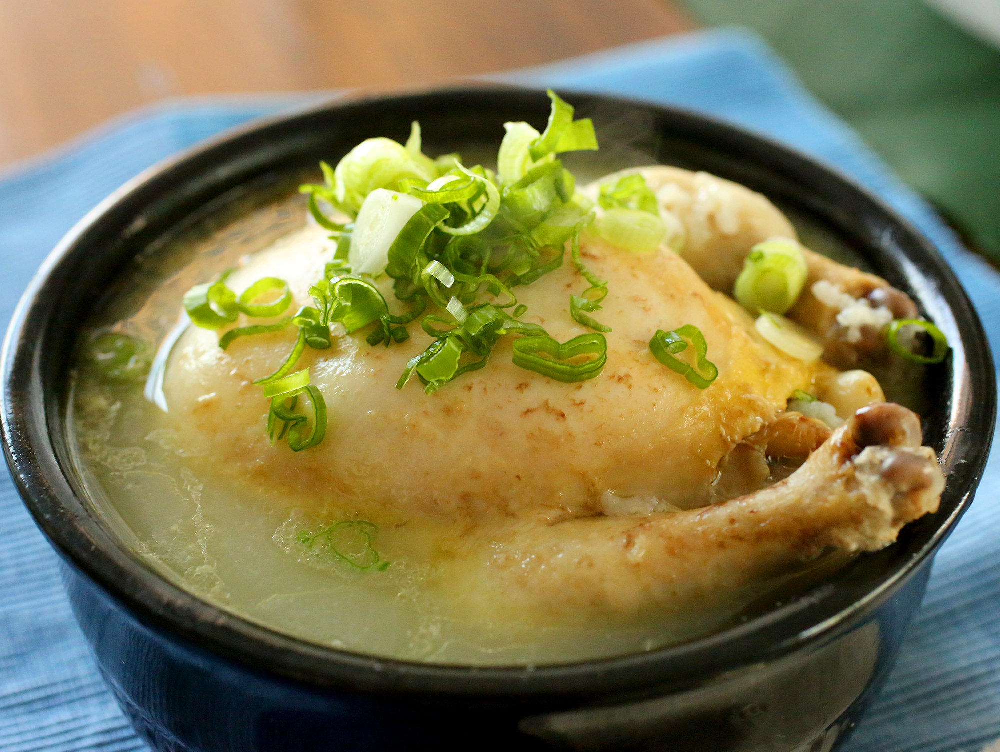

# Ginseng Chicken Tonic Soup (Chinese Style)
10 min preparation, 1-4 hrs cooking

## Spices:

- Huang Jing (Siberian Solomon’s Seal)
  - Cosmic Qi, Yang power, tonifies all Three Treasures. Makes the body light and clears the eyes.
- Goji Berry (Fructus Lycii)
  - Vision, liver and kidneys, neuroprotective
- Dang Shen (Codonopsis pilosula)
  - Enhance Qi and improve digestion, nourish blood, tonify lungs, boost vitality.
- Chinese Yam
- Ginseng Root
  - Manifold benefits
- (Huang Qi) Astragalia

These can usually be found in a Chinese grocer as a single mix, but buying each separate and in bulk avoids packing markup— you can store a giant glass jar of this for years, cheaply, and only have to buy fresh chicken.

Any kind of chicken is fine, but chicken with bones, like a Maryland or a whole spatchcock (small chicken) works best.

Prepare:

- Rinse, dry and salt chicken. Let sit for 30 minutes.
- Place herbs, water and chicken in a pot and bring to a boil, then reduce to simmer.
- Occasionally check in to remove solids from surface of soup or add water if needed.
- Cook for 1-4 hrs — 50% reduction is ideal.
- Remove chicken and chop to serving size. Season soup with salt and serve in a bowl.

Compare with [[korean-ginseng-chicken-soup]]

[//begin]: # "Autogenerated link references for markdown compatibility"
[korean-ginseng-chicken-soup]: korean-ginseng-chicken-soup "Samgyetang Ginseng Chicken Soup (Korean Style)"
[//end]: # "Autogenerated link references"